# Aerial Contest Index - Refined Analysis and Visualization of Aerial battles (WR vs DB)

Broadcast Visualization Track | [Baptiste Gorteau](https://bgorteau.github.io/) | [Final Video link](https://youtu.be/AORx_K5xiJY) | [Project's code](https://github.com/BGorteau/2026_Big_Data_Bowl)

# Introduction

In football, battles between wide receivers and defensive backs create exciting plays, especially during long passes. However, viewers often struggle to understand the details and key moments of these matchups. This project addresses the question: 

**How can we improve the understanding and visual analysis of aerial battles between wide receivers and defensive backs?**

We will first create a metric based on optimal transport theory, then develop visual analyses to display this metric during video replays.

*This project focuses on battles between a single defensive back (closest to the receiver) and the targeted receiver on passes of 20+ yards, which provide sufficient data for analysis.*

---

# Creating a metric - Aerial Contest Index

As stated in the introduction, we will create a metric based on [optimal transport theory](https://en.wikipedia.org/wiki/Transportation_theory_(mathematics)) to better understand these battles. This approach finds the optimal (least costly) way to transform one distribution into another. In football, this calculates the minimum effort required for a defensive back to align his position and coverage ability with the wide receiver's position while the ball is in the air. This leads to our next two steps: transforming players into distributions, then applying optimal transport between them.

## Transforming players into distributions

The first step is converting players into distributions. For each duel, we create two distributions: one for the defensive back (based on their skill level and field orientation) and one for the wide receiver (a standard 2D Gaussian for all receivers).

To calculate distributions, we use grids of 50 by 50 squares. Each square measures 0.5 yards across. This grid is centered on the action at frame $f$ and contains the coordinates $(x_{WR,f}, y_{WR,f})$ of the wide receiver and $(x_{DB,f}, y_{DB,f})$ of the defensive back. The coordinates of the grid itself are denoted $(X,Y)$. To facilitate calculations, the coordinates of this grid are re-centered relative to the original center of the grid.

  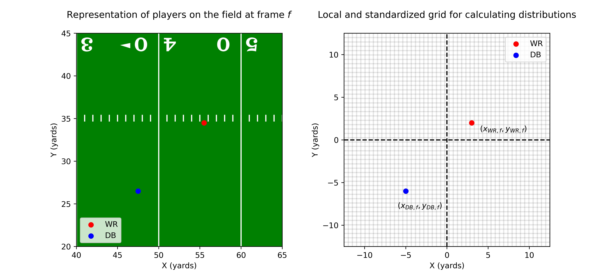

### Defensive backs

The distributions of defensive backs correspond to **non-normalized 2D Gaussian distributions, asymmetrical by quadrants and subject to rotation** centered on the position of the defender at frame $f$, oriented according to the player's orientation, and whose standard deviations are different and related to the player's level. These different standard deviations involve transforming the coordinates $(X,Y)$ into coordinates $(X_{t,f}, Y_{t,f})$ by applying a matrix multiplication between the angle rotation matrix for angle $\theta_{DB,f}$ (this angle corresponds to the defender's orientation, calculated between frame $f$ and $f-1$) and the matrix of points centered on the defender's position $(x_{DB,f}, y_{DB,f})$.

$$\begin{pmatrix} X_{t,f} \\ Y_{t,f} \end{pmatrix} = \begin{pmatrix} \cos(-\theta_{DB,f}) & -\sin(-\theta_{DB,f}) \\ \sin(-\theta_{DB,f}) & \cos(-\theta_{DB,f})\end{pmatrix} \begin{pmatrix} X-x_{DB,f} \\ Y-y_{DB,f} \end{pmatrix}$$

Now that the coordinates have been transformed, we can focus on calculating the player's distribution based on the different standard deviations, reflecting the defender's level. The defender's distribution is created using the $Z$ function, which takes the starting coordinates $(X, Y)$ as input and applies a negative exponential function to the formula for a normalized 2D Gaussian distribution, but with standard deviations $(\sigma_{x,DB}, \sigma_{y,DB})$ that change depending on the quadrant of $\mathbf{x}_{t,f} = (X_{t,f}, Y_{t,f})$

$$Z(X, Y) = \exp \left( - \frac{1}{2} \left[ \left( \frac{X_{t,f}}{\sigma_{x,DB}} \right)^2 + \left( \frac{Y_{t,f}}{\sigma_{y,DB}} \right)^2 \right] \right)$$

where the standard deviations $(\sigma_{x,DB}, \sigma_{y,DB})$ are defined by the conditions on $X_{t,f}$ and $Y_{t,f}$. The purpose of these conditions is to extend the defender's distribution over his areas of influence in front of him and on his sides, depending on his performance score $PS$*. If his performance score $PS$ is low, then his distribution will be low and his area of influence will be small. Conversely, if the defender's score $PS$ is high, then his distribution will be high and his area of influence will be large. The defender's standard deviation value varies between 1 and 4 in front of the player (Right), between 1 and 2 on the sides (Bottom and Top), and is always equal to 1 behind them (Left).

- $X_{t,f} < 0$ (Back/Left) $\longrightarrow \sigma_{\mathbf{x}, \text{left}, DB} = 1$
- $X_{t,f} \geq 0$ (Front/Right) $\longrightarrow \sigma_{\mathbf{x}, \text{right}, DB} = 1 + (\frac{PS}{100} \times 3)$
- $Y_{t,f} < 0$ (Side/Down) $\longrightarrow \sigma_{\mathbf{y}, \text{down}, DB} = \frac{1 + (\frac{PS}{100} \times 3)}{2}$
- $Y_{t,f} \geq 0$ (Side/Up) $\longrightarrow \sigma_{\mathbf{y}, \text{up}, DB} = \frac{1 + (\frac{PS}{100} \times 3)}{2}$

**The performance score $PS$ ranges from 0 to 100 and is calculated using data from the R package `nflfastR`, taking into account the player's recent statistics and comparing them to other players in the same position.*

  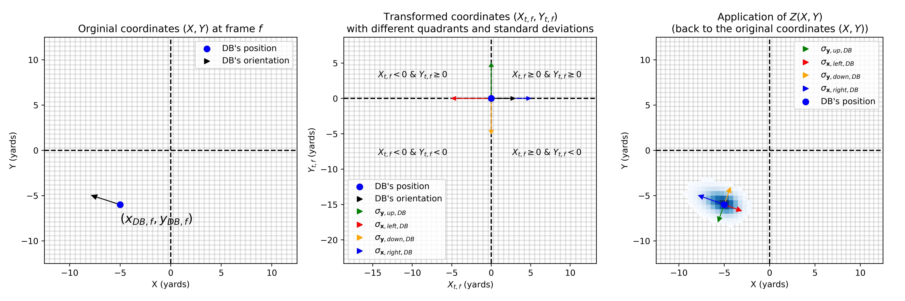

To better understand what these distributions might look like, we represent those of three defensive backs with different performance scores $PS$. We can see quite clearly the differences in the players' areas of influence based on their Performance Score $PS$.

  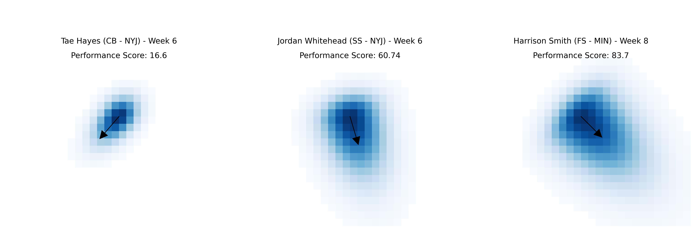

### Wide receivers

For wide receivers, their distribution corresponds to a 2D Gaussian centered on the receiver's position at frame $f$ $(x_{\text{WR},f}, y_{\text{WR},f})$ with a standard deviation of 1.

## Calculating the optimal transport cost between distributions

Now that we have the distributions of the defensive back and of the wide receiver, we can calculate the optimal transport cost between them. The optimal transport problem aims to find a way to transform an initial probability measure $\mu \in \mathcal{P}(\mathbb{R}^2)$ (the WR distribution) into a target probability measure $\nu \in \mathcal{P}(\mathbb{R}^2)$ (the DB distribution) by minimizing the transport cost. Each distribution point (from $\mu$ or $\nu$) is defined by its 2D coordinates on the normalized grid:

- The starting point $x$ (associated with the WR distribution $\mu$) is a coordinate vector: $x = (X_{\mu}, Y_{\mu})$.
- The arrival point $y$ (associated with the distribution $\nu$ of the DB) is a vector of coordinates: $y = (X_{\nu}, Y_{\nu})$.

The cost function $c(x, y)$ represents the effort required to transport a unit of distribution from point $x$ (WR) to point $y$ (DB) on the grid. Using the squared Euclidean distance:

$$c(x, y) = \|x - y\|^2 = (X_{\mu} - X_{\nu})^2 + (Y_{\mu} - Y_{\nu})^2$$

We are looking for the transport plan $\gamma(x, y)$, which is the joint probability distribution on $\mathbb{R}^2 \times \mathbb{R}^2$. This plan indicates how to link each point $x$ of distribution $\mu$ with each point $y$ of distribution $\nu$.

The solution to the optimal transport metric is the Wasserstein distance obtained by minimizing the total cost integrated over the 4D space ($\mathbb{R}^2 \times \mathbb{R}^2$) :$$W_2(\mu, \nu) = \left( \inf_{\gamma \in \Pi(\mu, \nu)} \int_{\mathbb{R}^2 \times \mathbb{R}^2} c(x, y) \, d\gamma(x, y) \right)^{1/2}$$

The figure below illustrates this principle more clearly. Here, we have two examples of optimal distribution transport between a defensive back and a wide receiver. The first example highlights a higher optimal transport cost ($W_2(\mu,\nu)=7.28$) for a defender with a lower level than the average of the other players in his position ($PS=16.6$). The second example shows the opposite situation with a lower transport cost ($W_2(\mu,\nu)=6.2$) for players in the same position as in the first example. The difference in cost is due to the very high level of the defensive back ($PS=83.7$).

  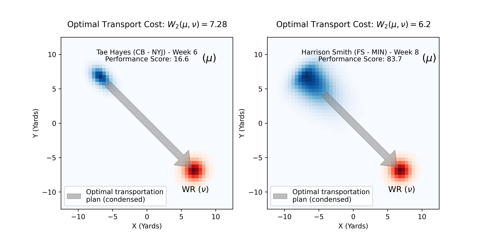

For each frame of an action, if the ball is in the air, we calculate the Wasserstein distance of the optimal transport plan $W_2(\mu, \nu)$ between the distributions of the defensive back ($\mu$) and that of the wide receiver ($\nu$) on whom we are focusing.

## Creating the metric (Aerial Contest Index) from the distances of the optimal transport plans

Once we have the Wasserstein distance $W_2(\mu, \nu)$ for each frame, we transform it into a readable metric with two goals:
- A 0-100 range
- Values near 100 indicating contested coverage (short distance) and near 0 indicating separation

We use **Quantile Normalization** to transform the asymmetric Wasserstein Distance distribution into the Aerial Context Index (ACI), which follows a normal distribution centered at 50 ($\mu_{\text{target}}$) with standard deviation 10 ($\sigma_{\text{target}}$).

Using a reference sample ($W_{\text{original}}$) from 302 plays (first three weeks of 2023 NFL season), we apply three steps to associate an ACI score with any new distance $W_{\text{new}}$:

**1. Determining the Empirical Rank (Percentile)**

This step allows us to situate the new distance $W_{\text{new}}$ in relation to the reference sample. We calculate the percentile ($P_{\text{new}}$), which is the proportion of distances $W_{\text{original}}$ that are less than or equal to $W_{\text{new}}$.

$$P_{\text{new}} = \frac{\text{Number of } W_{\text{original}} \le W_{\text{new}}}{\text{Original sample size}}$$

- **Interpretation**: A low cost ($W_{\text{new}}$) will have a low rank $P_{\text{new}}$.

**2. Transformation into an inverted Z-score**

To obtain a normal distribution and ensure that a low cost corresponds to a high score, we transform the percentile into a Z-score ($Z_{\text{new}}$) using the inverse quantile function ($\Phi^{-1}$) of the standard normal distribution:

$$Z_{\text{new}} = \Phi^{-1} (1 - P_{\text{new}})$$

- The term $1 - P_{\text{new}}$ reverses the scale (low $P$ $\implies$ high $1-P$ $\implies$ large $Z$).
- $Z_{\text{new}}$ is a standard deviation from the mean.

**3. Final scaling (ACI score)**

The $Z$-score is then scaled to match the distribution target, using $\mu_{\text{target}}=50$ and $\sigma_{\text{target}}=10$.

$$\text{ACI} = \mu_{\text{target}} + Z_{\text{new}} \times \sigma_{\text{target}}$$
$$\text{ACI} = 50 + Z_{\text{new}} \times 10$$

In the example below (game_id: 2023102204, play_id: 3849), we can compare the differences in scale as well as the evolution of the Wasserstein distance $W_2$ and the new $ACI$ score when the ball is in the air:

  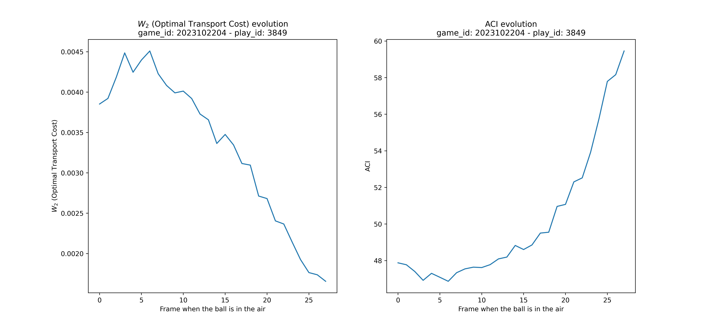

---

# Creating a video visualization for the metric

To visualize ACI scores in video, we use two Python libraries:

- `ultralytics`: For player detection using YOLO models
- `OpenCV`: For image processing

Three steps are required:

## Selecting the video clip and linking it to the data

First, we obtain a video clip of an aerial battle and associate it with its `game_id` and `play_id`. This enables us to calculate ACI values and retrieve timing and player data for the play.

## Initial detection and selection of players

Next, we run the YOLO detection model (`yolov8n-seg.pt`) on the video, which detects all people and objects with IDs. We store the IDs of the wide receiver and defensive back in a dictionary, along with their name, Performance Score ($PS$), and position. We also record the frame number when either player catches the ball to synchronize our data with the video.

  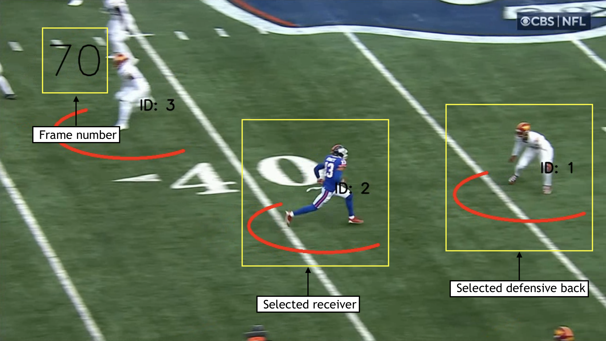

## Initial detection and selection of players

Next, we run the YOLO detection model (`yolov8n-seg.pt`) on the video, which detects all people and objects with IDs. We store the IDs of the wide receiver and defensive back in a dictionary, along with their name, Performance Score ($PS$), and position. We also record the frame number when either player catches the ball to synchronize our data with the video.

  

## Adding features to the video

Once the two players and the end-of-action frame have been selected, we add various features to the video using the `OpenCV` module. These will enable viewers to better understand the $ACI$ and thus better understand the interactions between the players when the ball is in the air. Here are the various features that can be found throughout the video.

  

 

<b>Feature descriptions table</b>

| Feature | Description        |
|---------|--------------------|
|  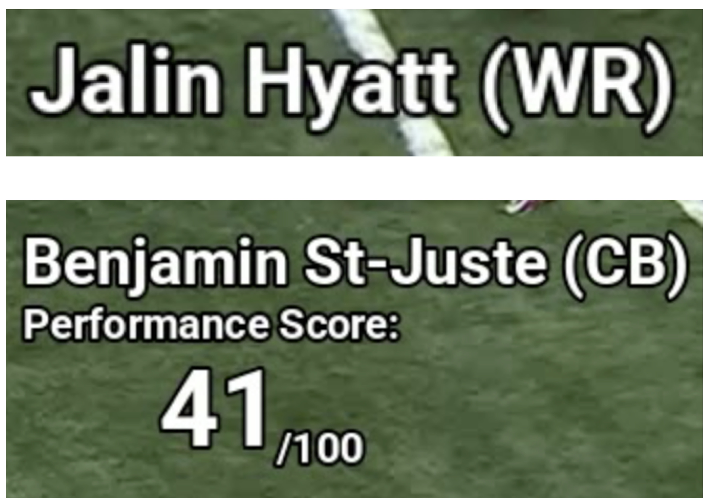 
Player descriptions
 | Description of the receiver and defensive back before the start of the play. For the defensive back, we add his performance score $PS$. |
| 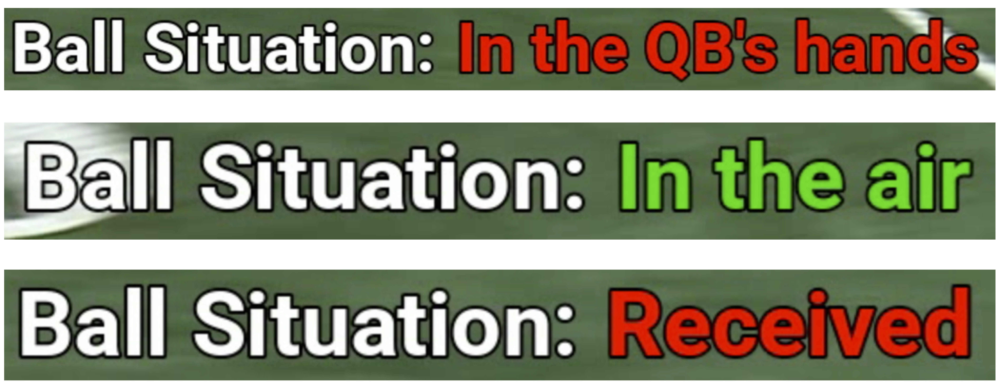 
Ball situation
    | Allows the viewer to know where the ball is during the play. |
| 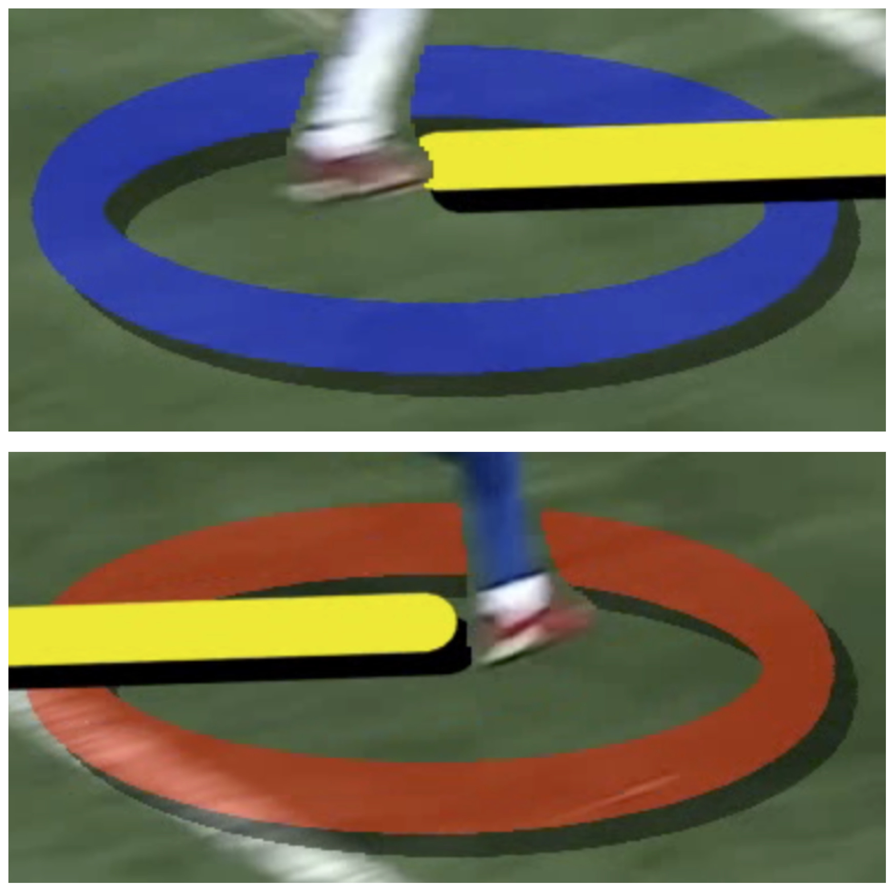 
Ellipses under players
    | Allows the viewer to focus on the receiver (red) and the defensive back (blue). |
| 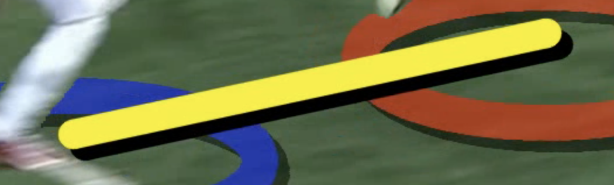 
ACI score line
    | This line shows the $ACI$ score between the two players. Its color varies depending on the score. |
| 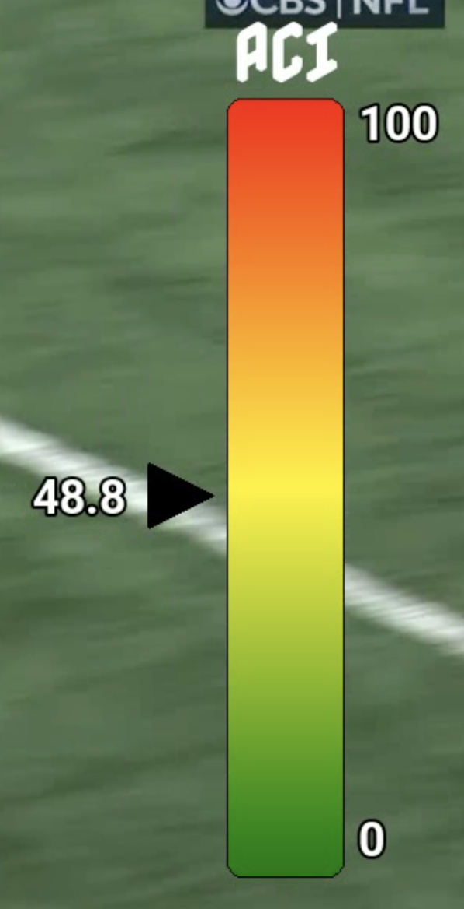 
ACI score bar
    | This bar allows the viewer to better visualize the evolution of the exact $ACI$ score between the two players. |

---

# Conclusion

In conclusion, we have been able to show how an advanced topology method can enable viewers to better understand some of the most beautiful actions in football. We can therefore ask ourselves whether other actions or even other sports could benefit from this type of analysis?

*1990 words*